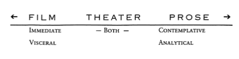

## 
Learning the differences between the 3 major platforms for a story (Film, Theater, Prose) can help a writer understand what she should concentrate on when writing the novel.

A fantastic book which will explain these differences in far more depth than I can here is : [The Playwright's Guidebook (Amazon)](https://amzn.to/4fMwmtY). 
Even though our focus is on writing a novel, I believe you'll find the explanations this book offers invaluable to your writing. 

Take a look at this overview diagram from that book and note that film is far more visceral and immediate and often built upon spectacle when compared to a novel (prose).
 

 Consider how that in a movie the viewer can never really know what the viewpoint character is thinking. There are, of course, exceptions to this where a voice-over is done, but film normally avoids this practice.

## Film : Viewer Learns By Seeing Action

In the best films, nothing has to be explained. No one has to voice-over "Jack felt very bad." Instead we see Jack suffer the pain, fall to the ground and then be carried off by the ambulance.

## Film: The Director, Directs The Viewer's Eye

In film, the director can zoom up on a specific element attempting to convince the watcher that this cup sitting on this table has importance to the over all story.

This is also alludes to what Anton Chekhov so rightly said :
<blockquote>
"If, in the first act, you have hung a pistol on the wall, then in the following one it should be fired. Otherwise don't put it there."
</blockquote>

## The Stage : Director Attempts to Direct Viewer's Eye
The Stage, by its nature, is less forceful. The Stage is wide and the audience can look anywhere. 

If actors do something on one side of the stage the audience may not notice an entire drama playing out on the other. 

In contrast, the Film director has total control (except for audience members who close their eyes purposely). However, the stage director has to focus on certain elements to draw the viewers eye to the important event.

## Prose: Internalization - Good and Quite Terrible
Prose (The Novel) allows a writer to focus more on internalizations of characters.
The novel allows the writer to go deep into what the character is thinking.

This is often a problem and it often occurs because The Novelist is thinking more about what she herself is thinking and feeling in the moment of writing than what her character is going through as the character goes through a scene. 

Suddenly, the novel becomes this exploration of how the writer feels. It's quite terrible to read books about characters who sit around doing nothing except contemplating their own lives all day.

## Many Characters In Novels Are Writers
An example of this is how many characters in novels end up being writers themselves. It's a cliche. So what is the solution?

## Why A ScreenWriter May Actually Write A Better Novel Than A Novelist
A Screenwriter, by nature, is going to think far more about the things she might film: action she can show on screen. 

This will produce a story that moves. This will produce a story where characters act out their internal feelings on the page. Amateur novelists often don't know what parts to write. They get confused and fall into the pit of internalization.

Yes, this again is the old "Show Don't Tell" cliche. But the cliche is valid.

As a reader, I don't want to know things like:
<blockquote>
John felt sad.
</blockquote>

## When Prose Transforms To Images and Readers See It All Play Out
When I'm reading a book, I want to see John and what he goes through on the movie-screen of my mind. I want the words to transform into images I can see playing out before me. That is the best form of prose of all.

Then, when I need some internalization to better understand the turmoil that John is going through I want a bit of that before he is again plunged into the action which is the story playing out in front of my eyes.

As novel writers, understanding how movies work to tell a story helps to make our writing much stronger.

~Keep on learning, keep on writing.
